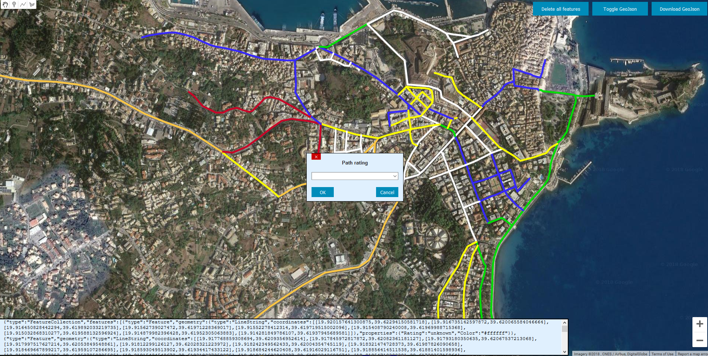

# ΙΟΝΙΟ ΠΑΝΕΠΙΣΤΗΜΙΟ 

# ΤΜΗΜΑ ΠΛΗΡΟΦΟΡΙΚΗΣ 

# ΜΑΘΗΜΑ
## Κινητά και Κοινωνικά Μέσα

# Επιλογή Εργασίας
## Συνεργατική χαρτογράφηση

Κυριακή Μουταφίδου
ΑΜ Π2013097

## Παραδοτέο 1
### Ο σύνδεσμος της σελίδας με την εφαρμογή.

https://kikh.github.io/corfu-map/

### Αποθετήριο κώδικα.

https://github.com/kikh/corfu-map

#### 1)  Όταν ανοίγει η εφαρμογή να είναι κεντραρισμένη και εστιασμένη (zoom) στην πόλη της Κέρκυρας.

Αλλάχθηκαν οι συντεταγμένες και το zoom ώστε ο χάρτης να είναι κεντραρισμένος και ζουμαρισμένος στην πόλη της Κέρκυρας

#### 2) Προσθέστε κουμπί εναλλαγής της εμφάνισης ή μη του παραγόμενου GeoJSON string. Σημειώστε ότι η εμφάνιση του εν λόγω string είναι υλοποιημένη μέσα στον κώδικα.

Χρησιμοποίησα jquery με την εντολή "toggle();" για να υλοποιήσω το ερώτημα. Προστέθηκε το κουμπί "Toggle GeoJson" όπου εμφανίζει εξαφανίζει το GeoJson string στο κάτω μέρος της εφαρμογής. Έχω τροποποιήσει το αρχείο style.css για να μορφοποιήσω το textarea που εμφανίζετε το string.

#### 3) Προσθέστε λειτουργία διαγραφής του σχήματος το οποίο θα επιλέγει ο χρήστης, καθώς και λειτουργία διαγραφής όσων έχουν σχεδιαστεί πάνω στο χάρτη.

Αρχικά προστέθηκε η λειτουργία όταν περνάς το ποντίκι πάνω απο κάποια οντότητα να αλλάζει χρώμα (Μαύρο). Με δεξί click μπορεί ο χρήστης να διαγραψει την συγκεκριμένη οντότητα. Προστέθηκε το κουμπί "Delete all features" οπου διαγράφει ότι έχει σχεδιαστεί πάνω στον Χάρτη.
Για την επιβεβαίωση της διαγραφής χρησιμοποιήθηκε το παράθηρο confirm της javascript.

#### 4) Χρησιμοποιώντας τη γραμμή από το εργαλείο σχεδίασης της εφαρμογής σας (πάνω αριστερά) προσπαθήστε να χαρτογραφήσετε τους δρόμους όπως τους βλέπετε από την εικόνα δορυφόρου. Εξάγετε το geojson αρχείο, ονομάστε το ως εξής: ΑΜ.geojson (π.χ. 2011999.geojson) και ανεβάστε το στο κεντρικό αποθετήριο στον φάκελο data. Μπορείτε να σχεδιάσετε όσα πολλά μονοπάτια επιθυμείτε με ελάχιστο όμως αριθμό τα 50. Επίσης, φροντίστε ώστε τα μονοπάτια να μην είναι ούτε πάρα πολύ μεγάλα ούτε πάρα πολύ μικρά. Τέλος, τροποποιείστε τον κώδικα της εφαρμογής ώστε να "διαβάζεται" το αρχείο όταν ανοίγει η εφαρμογή και να εμφανίζονται τα μονοπάτια πάνω στο χάρτη (βάλτε ένα αντίγραφο του geojson αρχείου σας στον φάκελο data του αποθετηρίου σας).
Χαρτογραφήθηκαν 70 μονοπάτια και έγινε εξαγωγή του GeoJson αρχείου το οποίο ανέβηκε στον φάκελο data του προσωπικού μου αποθετηρίου και εγινε και pull request προς το κεντρικό αποθετήριο της εργαασίας απο καθαρό κλαδί.
Τροποποιήθηκε η εφαρμογή ώστε να διαβάζει το GeoJson αρχείο. "Η εφαρμογή με το που ανοίγει διαβάζει πλέον το review.geojson. βλ επόμενο ερώτημα"

#### 5) Δημιουργείστε ένα σύστημα αξιολόγησης (rating system) της καταλληλότητας των δρόμων για πεζούς με 5 διαβαθμίσεις (η default επιλογή να είναι "unknown"). Ανάλογα με την αξιολόγηση του χρήστη, ο κάθε δρόμος να λαμβάνει αντίστοιχο χρώμα. Το καινούριο χαρακτηριστικό αξιολόγησης (property) να καταγράφεται στο GeoJSON αρχείο.
Δημιουργήθηκε σύστημα αξιολόγησης των μονοπατιών με βάση την καταλληλότητα των δρόμων για πεζούς. Όλα τα features με το που δημιουργηθούν έχουν default rating "unknown" και χρώμα άσπρο. Οι διαβαθμίσεις της αξιολόγησης είναι 1) very bad με χρώμα κόκκινο. 2) bad με χρώμα πορτοκαλί. 3) good με χρώμα κίτρινο. 4) very good με χρώμα μπλε και 5) excellent με χρώμα πράσσινο.
Χρησιμοποήθηκε το plugin bootbox.js για την υλοποίηση της αξιολόγησης.

#### 6) Αξιολογήστε τα μονοπάτια που γνωρίζετε/θυμάστε κατά πόσο είναι κατάλληλα/ευχάριστα για πεζούς και ανεβάστε τα καινούρια αρχεία στο κεντρικό αποθετήριο στον φάκελο data με όνομα AM_review.geojson (π.χ. 2011999_review.geojson).
Αξιολογήθηκαν κάποια μονοπάτια και καταγραφηκαν στο αρχείο _review.geojson το οποίο και ανέβηκε στον φάκελο data του προσωπικού μου αποθετηρίου και έγινε και το σχετικό pull request στο κεντρικό αποθετήριο.
Η εφαρμογή διαβάζει απο αυτό το αρχείο και Φαίνονται τα αξιολογημένα μονοπάτια.

Screenshot της εφαρμογής όπου φαίνονται τα αξιολογημένα μονοπάτια, το παράθυρο της αξιολόγησης και ανοιχτό το GeoJson string.

